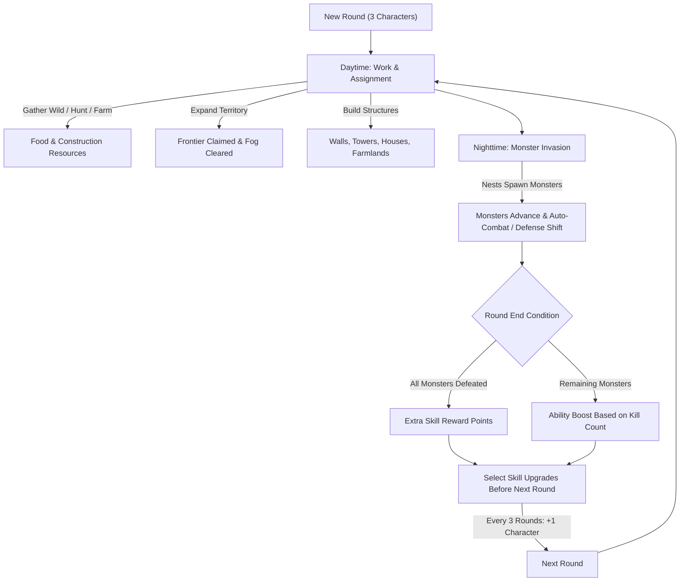

# Medievil (Python Game)

## Title

**Medievil** (Medieval Fantasy Colony Survival)

## Background & Theme

- **Setting**: Medieval fantasy style (中世紀 魔法風).
- **Creatures & Magic**: Magical creatures (werewolves, vampires, zombies, wolves, bears, wild boars, flying squirrels, fish, horses) and elemental magic.
- **Player Role**: The player acts as the **Lord (領主)**, assigning work, managing territory growth, building defenses, and directing colony priorities.

---

## Game System

### Core System (ONI-style Task Model)

> Based on the **Oxygen Not Included** task and priority system.

- Player places global task designations on the grid (e.g., gather resources, expand fog/claimed territory, construct defensive buildings, or demolish/destroy structures).
- NPCs autonomously evaluate the global task queue according to their individual priority rankings and claim available work.

### Sight and Map

- **Top-Down 2D Grid**: The world is composed of square tiles which can be unexplored (Fog of War), unclaimed, claimed empty land, or containing resource nodes.
- **Frontier Expansion**: Claiming territory clears fog-of-war and makes land buildable.

---

## Round System (回合制)

The game follows a day/night round cycle:

### 1. Daytime (白天) — Assignment Phase
- **Food Production**:
  - Gather Wild (採集野生)
  - Hunt Animals (打獵)
  - Farm & Plant Crops (種植)
- **Territory Expansion (開拓領土)**: Scout frontiers and clear fog of war.
- **Construction (建造防禦)**: Construct defensive walls, towers, houses, and farmland.

### 2. Nighttime (晚上) — Monster Assault Phase
- **Nest Spawning (巢穴生成怪物)**: Monster nests activate and spawn creatures.
- **Monster Advance (怪物朝領地前進)**: Monsters march toward claimed colony territory.
- **Night Watch & Defense (夜晚排班與戰鬥)**: Characters rest, while those on shift / near threats defend the colony.

### 3. Post-Round (怪物結算與技能成長) — Growth Phase
- **All Monsters Cleared (怪物全部打完)**: Grants bonus skill reward points.
- **Remaining Monsters (有剩餘怪物沒打完)**: Grants ability improvements proportional to monster kill count.
- **Skill Selection (增加技能)**: Player selects skill upgrades before the next round begins.

### Character Growth (角色增長)
- **Starting Colony**: Start with **3 characters (三隻角色)**.
- **Colony Growth**: Every **3 rounds**, receive **+1 additional character (經過三回合增加一隻)**.

---

## Roles & Specialties (角色與初心擅長領域)

Three distinct character classes, each with initial specialized fields:

| Role | Chinese | Specialty 1 | Specialty 2 | Key Characteristics |
|------|---------|-------------|-------------|---------------------|
| **Farmer** | 農民 | Gather Speed (採集速度) | Taming Ability (馴服能力) | Faster crop/wild harvesting, tames hunted animals into pens |
| **Knight** | 騎士 | Hunting Accuracy (打獵準度) | Defense Ability (防禦能力) | Frontline melee combat, higher defense/health, hunts wild game |
| **Mage** | 魔法師 | Magic Attack (魔法攻擊) | AoE Attack (群體攻擊) | High-damage ranged spells, crowd control against swarms |

---

## Skills System (技能體系)

Characters can upgrade 6 core abilities:
1. **Gather Speed (採集速度)** — accelerates harvest and gathering work duration.
2. **Hunting Accuracy (打獵準度)** — improves hit rate and efficiency when hunting wild animals.
3. **Taming Ability (馴服能力)** — increases success and speed of taming hunted creatures.
4. **Defense Ability (防禦能力)** — reduces damage taken from monster attacks.
5. **Magic Attack (魔法攻擊)** — boosts single-target spell damage.
6. **AoE Attack (群體攻擊)** — increases multi-target and area spell effectiveness.

---

## Magic System (魔法體系)

Castable combat spells:
- **Fire (火焰)** — Fire-based single/area damage.
- **Lightning (閃電)** — High electric damage burst.
- **Freeze (凍結)** — Ice crowd-control, slowing or immobilizing monster advances.

---

## Buildings & Structures (防禦性建築)

| Structure | Chinese | Function | Strategic Purpose |
|-----------|---------|----------|-------------------|
| **Wall** | 城牆 | High block rating | Physically obstructs and stalls monster pathing |
| **Arrow Tower** | 箭塔 | Ranged automated attack | Attacks advancing monsters from a distance |
| **House** | 房子 | Population capacity | Increases maximum character population limit |
| **Farmland** | 農地 | Cultivation tile | Enables organized planting and farming of crops |

---

## Resources & Items Taxonomy

### Construction Materials (建築原料)
- **Marble (大理石)**
- **Wood (木頭)**
- **Bricks (磚頭)**

### Magic Materials (魔法原料)
- **Berries (莓果)**
- **Raw Stone (原石)**

### Food Sources (食物來源)
| Acquisition Method | Items | Usage / Notes |
|--------------------|-------|---------------|
| **Gather Wild (採集野生)** | Mushrooms (香菇) | Foraged directly from uncultivated map tiles |
| **Farming (種植)** | Vegetables (蔬菜), Tomatoes (番茄) | Grown on Farmland tiles for stable food supply |
| **Hunting (打獵)** | Flying Squirrel (飛鼠), Wild Boar (山豬), Fish (魚), Horse (馬) | Hunted animals can be **Tamed (馴服)** into farm pens or processed as **Food (食物)** |

> **Food Spoilage (食物放久會腐敗)**: Harvested food items decay/spoil over time if left unconsumed.

---

## Creatures Taxonomy

### Hostile Monsters (怪物)
- **Werewolf**
- **Vampire**
- **Zombie**
- Spawned from monster nests at night and advance toward player structures.

### Fauna & Animals (可打獵 / 可馴服)
- **Wolf**
- **Bear**
- **Wild Boar (山豬)**
- **Flying Squirrel (飛鼠)**
- **Fish (魚)**
- **Horse (馬)**

---

## Character Status & Vitals (角色狀態條)

Each NPC maintains two continuous vital bars:
- **Health/Stamina Bar (體力血條)**: Depleted during monster combat.
- **Hunger Bar (飢餓血條)**: Continuously decays over time. When hunger drops below threshold, NPCs eat food from the colony inventory.

---

## Game Over Conditions (遊戲結束判定)

The game ends in **Game Over** when **all characters die (所有角色死亡)** through:
1. **Combat Casualty (被攻擊而死亡)** — Health reaches 0 from monster attacks.
2. **Starvation (因飢餓而死亡)** — Hunger drops to 0 when food requirements are unmet.

---

## Win / Score Condition

Endless survival score based on the **number of rounds survived**.

---

## Controls & Interaction Reference

- **`1`**: Select **Gather** task
- **`2`**: Select **Expand** task
- **`3`**: Select **BuildWall** task
- **`4`**: Select **BuildTower** task
- **`5`**: Select **Destroy** task (Demolish existing building)
- **`Tab`**: Cycle task selection
- **`P`**: Toggle **Priority Table UI** (Set individual NPC work priority)
- **`Space`**: Pause / Resume simulation
- **`W / A / S / D` / `Arrow Keys`**: Pan map camera
- **`Left Click`**: Select NPC or place active task on tile
- **`Mouse Hover`**: Real-time tile inspection in HUD (Coordinates, Fog/Claim status, Resource material, Building stats, NPC vitals)
